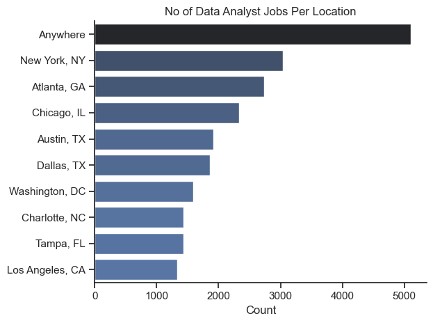
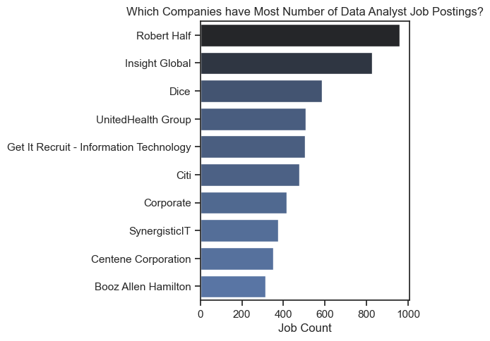
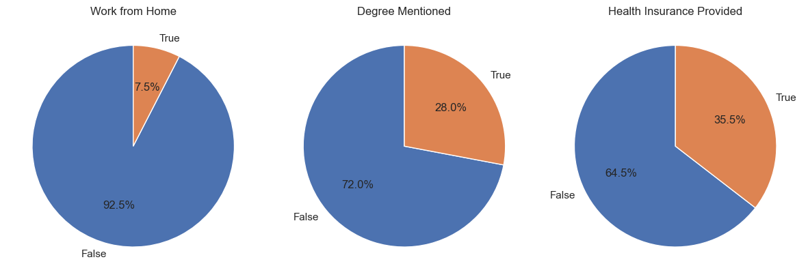
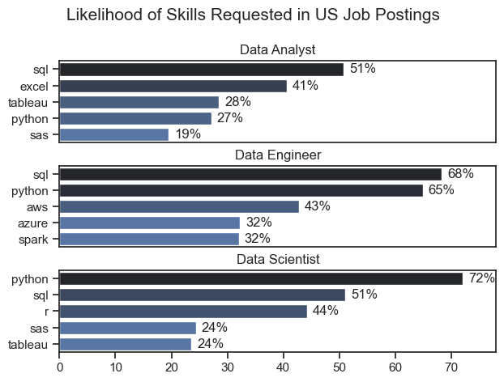
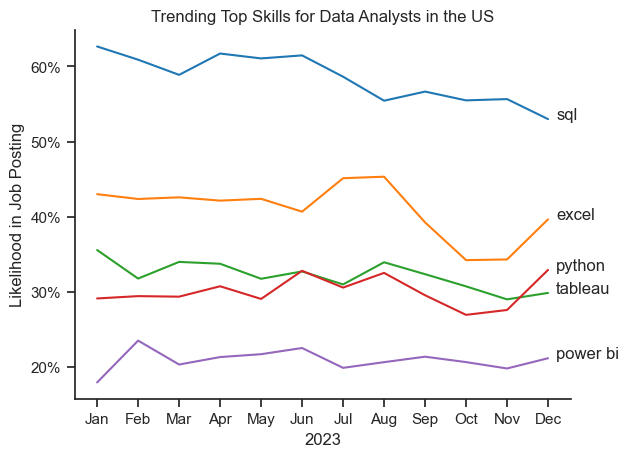
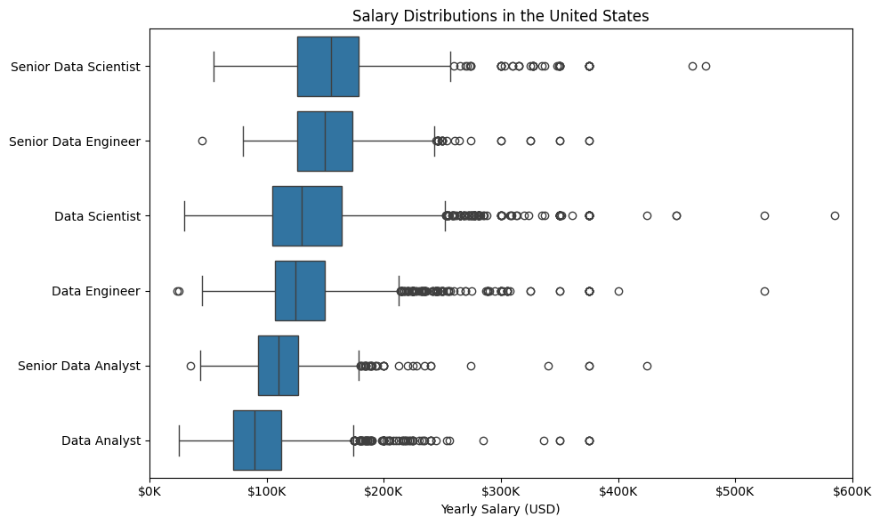
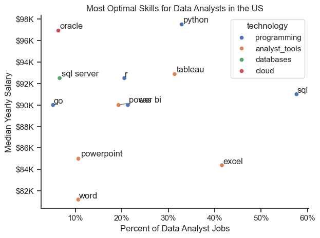

# Data Job Market Analysis – Exploratory Data Analysis

## Overview

This project analyzes **Data Analyst job postings in the United States** to understand hiring patterns, top locations, and companies actively hiring. The analysis also examines common job characteristics such as remote work availability and benefits.

### View the Notebook : [EDA Intro](python_projects/1_EDA_intro.ipynb)

## The Questions

This analysis focuses on answering the following questions:

1.Which locations have the highest number of Data Analyst job postings?

2.Which companies are hiring the most Data Analysts?

3.How common are certain job characteristics such as:

- Remote work

- Degree mentions

- Health insurance benefits?

## Tools I Used

For this analysis I used several Python tools for data processing and visualization.
1. **Python** – Core language for the analysis  
2. **Pandas** – Data manipulation and cleaning  
3. **Matplotlib** – Data visualization  
4. **Seaborn** – Statistical data visualization  
5. **HuggingFace Datasets** – Loading the job posting dataset  
6. **Jupyter Notebook** – Running the analysis

## Data Preparation and Cleanup

- The dataset was loaded using the **HuggingFace datasets library** and converted into a **Pandas DataFrame**.

- Key preparation steps included:
  - Converting job posting dates to **datetime format**
  - Converting the `job_skills` column from **string format to Python lists**
  - Filtering only **Data Analyst jobs located in the United States**

- **Importing required libraries**

### Importing Libraries

```python
import pandas as pd
import matplotlib.pyplot as plt
import seaborn as sns
from datasets import load_dataset
from ast import literal_eval
```

### Loading and Cleaning the Data

```python
dataset = load_dataset("lukebarousse/data_jobs")
df = dataset['train'].to_pandas()

df['job_posted_date'] = pd.to_datetime(df['job_posted_date'])

df['job_skills'] = df['job_skills'].apply(
    lambda x: literal_eval(x) if pd.notna(x) else x
)

df_da_us = df[
    (df['job_title_short'] == 'Data Analyst') &
    (df['job_country'] == 'United States')
]
```
## The Analysis

Each section investigates a key aspect of the Data Analyst job market using aggregated job posting data.

### 1. Top Locations for Data Analyst Jobs

To understand where demand is concentrated, I analyzed job posting counts by location in the USA.



Code
```python
df_location = df_da_us['job_location'].value_counts().head(10)

sns.barplot(
    y=df_location.index,
    x=df_location.values
)
```

### 2. Companies Posting the Most Data Analyst Jobs

Next, I examined which companies are most active in hiring Data Analysts.



Code
```python
df_companies = df_da_us['company_name'].value_counts().head(10)

sns.barplot(
    y=df_companies.index,
    x=df_companies.values
)
```

### 3. Job Characteristics

Finally, I explored how often job postings mention remote work, degree requirements, and health insurance benefits.



Code
```python
fig, ax = plt.subplots(1,3)

columns = [
    'job_work_from_home',
    'job_no_degree_mention',
    'job_health_insurance'
]

for i, col in enumerate(columns):
    df_da_us[col].value_counts().plot.pie(
        ax=ax[i],
        autopct='%1.1f%%'
    )
```
## Insights
- Data Analyst roles are heavily concentrated in a small number of major U.S. cities.

- A few companies account for a significant share of job postings.

- Remote work appears in a meaningful portion of job listings.

- Benefits and educational requirements vary across employers.

# 2. Skill Demand Analysis for Data Roles

### Overview

This section analyzes the **most in-demand skills across major data roles**.  
The analysis identifies which technical skills appear most frequently in job postings for **Data Analysts, Data Scientists, and Data Engineers**.

Find the notebook here:  
[Skill Demand](python_projects/2_skill_demand.ipynb)

---

## Key Question

**What are the most demanded skills for the top 3 most common data roles?**

---

## Data Preparation

- Converted `job_posted_date` to **datetime format**
- Converted `job_skills` from **string format to Python lists**
- Filtered **U.S. job postings**
- Exploded the `job_skills` column to analyze skills individually
- Aggregated skill counts by **job role**

---

## Importing Libraries

```python
import pandas as pd
import matplotlib.pyplot as plt
import seaborn as sns
from datasets import load_dataset
from ast import literal_eval
```

## Loading and Cleaning the Data

```python
dataset = load_dataset("lukebarousse/data_jobs")
df = dataset['train'].to_pandas()

df['job_posted_date'] = pd.to_datetime(df['job_posted_date'])

df['job_skills'] = df['job_skills'].apply(
    lambda x: literal_eval(x) if pd.notna(x) else x
)
```

---

## The Analysis

## Skill Demand by Job Posting Percentage

This visualization shows the **likelihood of each skill appearing in job postings**, normalized by the total number of postings for each role.  
It highlights the most requested skills for the three most common data roles.



### Code

```python
sns.barplot(
    data=df_plot,
    x='skill_pct',
    y='job_skills',
    hue='skill_count',
    palette='dark:b_r'
)
```

---

## Insights

- **SQL is one of the most consistently requested skills** across Data Analyst and Data Scientist roles.
- **Python dominates Data Science and Data Engineering roles.**
- **Data Engineering roles emphasize infrastructure and backend tools** more heavily than analytics tools.
- Data Analyst roles focus more on **SQL, Excel, and visualization technologies.**

# 3. Skill Trend Analysis for Data Analysts

### Overview

This section analyzes **how in-demand skills for Data Analysts change over time**.  
The goal is to identify which skills remain consistently important and which skills show emerging demand.

Find the notebook here:  
[Skills Trend](python_projects/3_skills_trend.ipynb)

---

## Key Question

**How are in-demand skills trending for Data Analysts over time?**

---

## Data Preparation

- Converted `job_posted_date` to **datetime format**
- Extracted **month values** from job posting dates
- Filtered **Data Analyst roles in the United States**
- Exploded the `job_skills` column to analyze skills individually
- Created a **pivot table of skill frequency by month**
- Converted skill counts into **percentage likelihood per job posting**

---

## Importing Libraries

```python
import pandas as pd
import matplotlib.pyplot as plt
import seaborn as sns
from datasets import load_dataset
from ast import literal_eval
```

---

## Loading and Cleaning the Data

```python
dataset = load_dataset("lukebarousse/data_jobs")
df = dataset['train'].to_pandas()

df['job_posted_date'] = pd.to_datetime(df['job_posted_date'])

df['job_skills'] = df['job_skills'].apply(
    lambda x: literal_eval(x) if pd.notna(x) else x
)
```

---

## The Analysis

## Trending Skills for Data Analysts

This visualization shows how the **top Data Analyst skills evolve across the year**, measured by the percentage of job postings mentioning each skill.



### Code

```python
sns.lineplot(
    data=df_plot,
    dashes=False,
    palette='tab10'
)
```

---

## Insights

- **SQL remains consistently dominant** across Data Analyst job postings.
- **Python maintains strong demand** throughout the year.
- Visualization tools such as **Tableau remain stable core skills**.
- The demand for key analytics tools remains **relatively steady rather than seasonal**.

# 4. Salary Analysis for Data Roles

### Overview

This section analyzes **salary distributions across major data roles**.  
The goal is to understand how compensation differs between roles and identify which positions command the highest salaries.

Find the notebook here:  
[Salary Analysis](python_projects/4_salary_analysis.ipynb)

---

## Key Question

**How do salaries compare across different data roles?**

---

## Data Preparation

- Converted `job_posted_date` to **datetime format**
- Converted `job_skills` from **string format to Python lists**
- Filtered **U.S. job postings**
- Removed entries with **missing salary values**
- Selected the **six most common data job titles**

---

## Importing Libraries

```python
import pandas as pd
import matplotlib.pyplot as plt
import seaborn as sns
from datasets import load_dataset
from ast import literal_eval
```

---

## Loading and Cleaning the Data

```python
dataset = load_dataset("lukebarousse/data_jobs")
df = dataset['train'].to_pandas()

df['job_posted_date'] = pd.to_datetime(df['job_posted_date'])

df['job_skills'] = df['job_skills'].apply(
    lambda x: literal_eval(x) if pd.notna(x) else x
)
```

---

## The Analysis

## Salary Distribution by Data Role

This visualization shows the **salary distribution for the six most common data roles in the United States**.  
Box plots highlight differences in median salaries and salary ranges.



### Code

```python
sns.boxplot(
    data=df_US_top6,
    x='salary_year_avg',
    y='job_title_short',
    order=job_order
)
```

---

## Insights

- **Senior and specialized data roles command the highest salaries.**
- Roles such as **Data Scientists and Data Engineers tend to have higher median salaries** than Data Analysts.
- Salary ranges vary significantly within roles, indicating differences in **experience levels and company types**.
- The distribution highlights the **wide earning potential across data-related careers.**

# 5. Optimal Skills for Data Analysts

### Overview

This section identifies the **most optimal skills for Data Analysts**, considering both **salary potential and job demand**.  
The goal is to highlight skills that offer the best combination of **high compensation and strong market demand**.

Find the notebook here:  
[Optimal Skills](python_projects/5_optimal_skills.ipynb)

---

## Key Question

**Which skills provide the best combination of high salary and strong demand for Data Analysts?**

---

## Data Preparation

- Converted `job_posted_date` to **datetime format**
- Converted `job_skills` from **string format to Python lists**
- Filtered **Data Analyst jobs in the United States**
- Removed entries with **missing salary values**
- Exploded the `job_skills` column to analyze skills individually
- Calculated **median salary and demand percentage for each skill**

---

## Importing Libraries

```python
import pandas as pd
import matplotlib.pyplot as plt
import seaborn as sns
from datasets import load_dataset
from ast import literal_eval
```

---

## Loading and Cleaning the Data

```python
dataset = load_dataset("lukebarousse/data_jobs")
df = dataset['train'].to_pandas()

df['job_posted_date'] = pd.to_datetime(df['job_posted_date'])

df['job_skills'] = df['job_skills'].apply(
    lambda x: literal_eval(x) if pd.notna(x) else x
)
```

---

## The Analysis
## Optimal Skills: Demand vs Salary

This visualization shows the relationship between **skill demand and median salary for Data Analyst roles**.  
Skills appearing in the **upper-right region** represent the most valuable skills — combining strong market demand with higher salaries.



### Code

```python
sns.scatterplot(
    data=df_plot,
    x='skill_percent',
    y='median_salary',
    hue='technology'
)

from adjustText import adjust_text

texts = []
for i, txt in enumerate(df_plot['job_skills']):
    texts.append(
        plt.text(
            df_plot['skill_percent'].iloc[i],
            df_plot['median_salary'].iloc[i],
            txt
        )
    )

adjust_text(texts, arrowprops=dict(arrowstyle='->', color='gray'))

from matplotlib.ticker import PercentFormatter

ax = plt.gca()
ax.yaxis.set_major_formatter(plt.FuncFormatter(lambda y, pos: f'${int(y/1000)}K'))
ax.xaxis.set_major_formatter(PercentFormatter(decimals=0))

sns.despine()
plt.tight_layout()
plt.show()
```

---

## Insights

- **Python offers strong salary potential while maintaining high demand.**
- **SQL remains one of the most universally required analytics skills.**
- Some specialized tools provide **higher salaries but appear less frequently in job postings.**
- Skills that balance **high demand and strong salaries represent the most strategic learning opportunities for Data Analysts.**